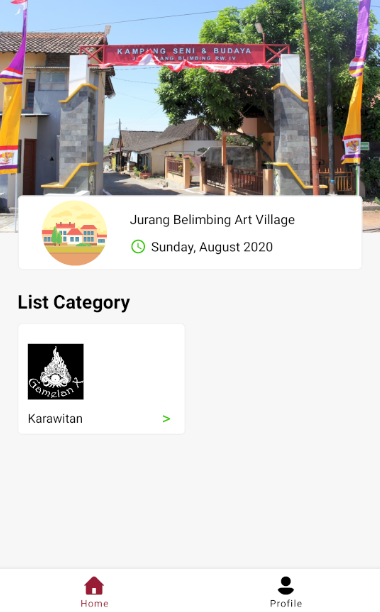
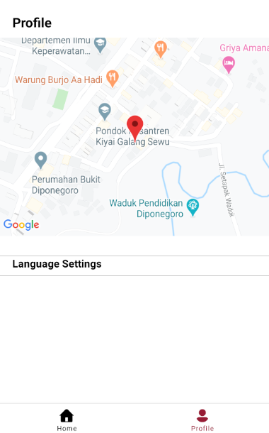
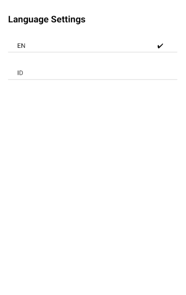

## JALIMBING APP

KKN TIM 2 UNDIP 2020

### Getting Started

This project stacks: 
- react-native: "0.63.2"
- react-navigation: "5.7.3"

### Installing

How to start new project with this repo

- Clone this repository
```
git clone *this repository* <newFolderName>
```

- Open terminal in your code editor and install npm package
```
npm install
```

- rename env-example.js in directory app/config/env-example.js into env.js

- Then put your MAPS API, YOUTUBE API KEY into env.js

- Then put your MAPS API KEY into AndroidManifest.xml file

- Open the android project with Android Studio

- Connect your device into pc/laptop

- Finally, in your code editor terminal type this command
```
npx react-native run-android
```
to run the app in your device

### Documentation
>
>
> <br/>
